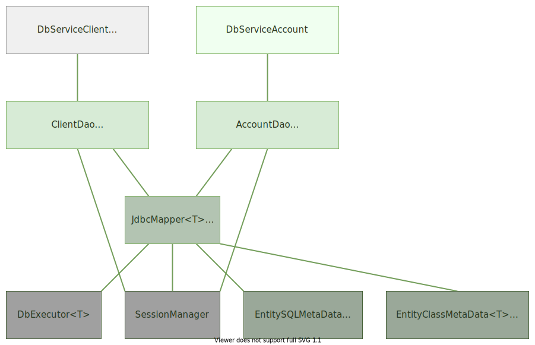

#hw18-jdbc: самодельный ORM

1. Создайте в базе таблицу Client с полями:

   - id целое число

   - name строка

   - age целое число

2. Создайте свою аннотацию @Id

3. Создайте класс Client (с полями, которые соответствуют таблице, поле id отметьте аннотацией).

4. Реализуйте интерфейс JdbcMapper<T>, который умеет работать с классами, имеющими поле с аннотацией @Id.
JdbcMapper<T> должен сохранять объект в базу и читать объект из базы.
Для этого надо реализовать оставшиеся интерфейсы из пакета mapper.
Таким обзазом, получится надстройка над DbExecutor<T>, которая по заданному классу умеет генерировать sql-запросы.
А DbExecutor<T> должен выполнять сгенерированные запросы.

5. Имя таблицы должно соответствовать имени класса, а поля класса - это колонки в таблице.
Проверьте его работу на классе Client.

6. Создайте еще одну таблицу Account:
   - no строка
   - type строка
   - rest число с плавающей точкой

7. Создайте для этой таблицы класс Account и проверьте работу JdbcMapper на этом классе.

